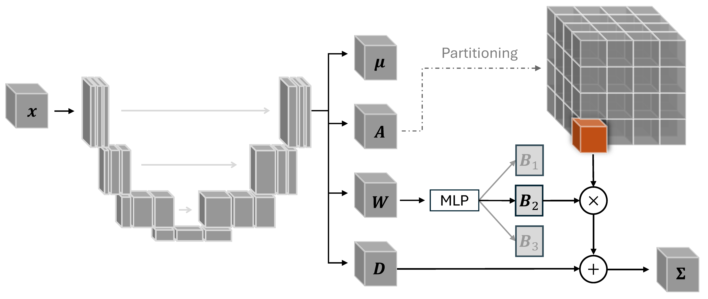

# mob-seg3d

This repository implements **Mixture-of-Bases** and **Single-Basis** covariance models for uncertainty-aware 3D medical image segmentation on top of **nnU-Net v2**, as described in our NLDL paper.

   
  <em>Figure 1: Overview of the Mixture-of-Bases (MoB) model.</em>

The code builds directly on the official nnU-Net implementation:
https://github.com/MIC-DKFZ/nnUNet

*Isensee, F., Jaeger, P. F., Kohl, S. A., Petersen, J., & Maier-Hein, K. H. (2021). "nnU-Net: a self-configuring method for deep learning-based biomedical image segmentation." Nature methods, 18(2), 203-211.*

All credit for the base framework belongs to the nnU-Net authors. This repository introduces targeted modifications and extensions to support structured covariance modeling and stochastic segmentation. Installation details and general usage of nnU-Net are documented in the original repository; below we provide an explicit guide describing the exact steps used in the paper.

---

## Installation

Install PyTorch following the official instructions:
https://pytorch.org/get-started/locally/

The experiments in the paper were run with:
- PyTorch 2.8.0  
- CUDA 12.8  
- Python 3.13.5

Clone this repo.

Navigate to the toe nnUNet folder in the repo and install this modified nnU-Net version in editable mode:

    cd mob-seg3d/nnUNet
    pip install -e .

---

## Step 0: Download the data

Download the TotalSegmentator dataset from Zenodo:  
https://zenodo.org/records/10047292

After extraction, the dataset should contain subject folders `sXXXX/` with `ct.nii.gz` and a `segmentations/` subfolder.

---

## Step 1: Train a deterministic nnU-Net

### Prepare the dataset

Convert the TotalSegmentator dataset to nnU-Net format using:

    python prepare_totalseg.py \
      --base_dir /path/to/Totalsegmentator_dataset_v201 \
      --nnunet_raw /path/to/nnUNet_raw \
      --organ pancreas \
      --dataset_id 1

This creates:

    nnUNet_raw/Dataset001_TotalSegmentatorPancreas/
    

### Create data.json file

Generate the nnU-Net `dataset.json` file using:

    python make_dataset_json.py \
      --root /path/to/nnUNet_raw/Dataset001_TotalSegmentatorPancreas \
      --name Dataset001_TotalSegmentatorPancreas \
      --labels background=0 pancreas=1

This step defines the dataset metadata (modalities, labels, and train/test splits) required by nnU-Net.

### Set nnU-Net environment variables

    export nnUNet_raw=/path/to/nnUNet_raw
    export nnUNet_preprocessed=/path/to/nnUNet_preprocessed
    export nnUNet_results=/path/to/nnUNet_results

### Run nnU-Net

Extract dataset fingerprint:

    nnUNetv2_extract_fingerprint -d <dataset_id> -verify_dataset_integrity -pl nnUNetPlannerResEncL -c 3d_fullres

Plan the experiment:

    nnUNetv2_plan_experiment -d <dataset_id> -c 3d_fullres -pl nnUNetPlannerResEncL -np 4

Preprocess the dataset:

    nnUNetv2_preprocess -d <dataset_id> -c 3d_fullres -pl nnUNetResEncUNetLPlans -np 8

Train the model (choose a single fold - possible values are 0, 1, 2, 3 or 4):

    nnUNetv2_train <dataset_id> 3d_fullres <fold> -tr nnUNetTrainerNoMirroring -p nnUNetResEncUNetLPlans

This step produces a dataset-specific metadata file:

    info_dict_<dataset_id>.pkl

The file is saved automatically to the project root (/.../mog-seg3d/) and is required for the stochastic models.

---

## Step 2: Train the stochastic nnU-Net

Training the **Single-Basis** and **Mixture-of-Bases** models uses the trained deterministic nnU-Net and the generated `info_dict_<dataset_id>.pkl`.

Use `src/trainer.py` to continue training the models. Insert relevant paths on your device in `DATASET_TO_PATHS` and `DATASET_TO_PATHS`.
To recreate the results of the main results from the paper, when running `src/triainer.py` use either `--exp_type basic` or `--exp_type multi_basis`. 

Hyperparameters for training is set in the dict `TRAINING_KWARGS` in `src/trainer.py`. To run mixture-of-bases on the pancreas dataset use

    python trainer.py --outdir /scratch/pjtka/mob-segref-test --dataset pancreas --exp_type multi_basis  --exp_name <name-of-experiment> --recreate True

---
